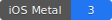
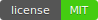

<p align="center">
   
</p>

<p align="center">
    <a href="https://swift.org/about/#swiftorg-and-open-source"></a>
    <a href="https://developer.apple.com/xcode/"></a>
    <a href="https://developer.apple.com/metal/"></a>
    <a href="http://doge.mit-license.org"></a>
</p>

## Overview

<p float="center"> 
 
 
 
 
</p>

This project demonstrates how to apply MetalKit filters to static images on iOS. It showcases the power of MetalKit for GPU-accelerated image processing, allowing you to efficiently apply a variety of visual effects to images. This example is perfect for learning how to use Metal to manipulate images without the need for real-time camera input, making it ideal for photo editing apps or any application that requires high-performance image processing.

## Metal Kernel Methods
The project includes several custom Metal kernel methods, each designed to apply unique filter effects to images, showcasing Metal's capability for high-performance image processing.

</p></details>
<details><summary>Blur Kernel</summary><p>

### Transforming an Image into Its Blurred Version: ###
The Blur kernel method in the project is designed to apply a smoothing effect to an image, effectively reducing detail and noise. This is achieved by averaging the color values of surrounding pixels, creating a softened, out-of-focus effect often used in photography and image editing.

```swift
kernel void mtlblur(texture2d<float, access::read> inputTexture [[texture(0)]],
                    texture2d<float, access::write> outputTexture [[texture(1)]],
                    constant float &intensity [[buffer(0)]],
                    uint2 gid [[thread_position_in_grid]]) {
    
    if (gid.x >= outputTexture.get_width() || gid.y >= outputTexture.get_height()) {
         return;
     }

     float clampedIntensity = clamp(intensity, 0.0, 1.0);
     int offset = int(5.0 * clampedIntensity);

     float4 color = float4(0.0);

     color += inputTexture.read(uint2(gid.x - offset, gid.y - offset));
     color += inputTexture.read(uint2(gid.x, gid.y - offset));
     color += inputTexture.read(uint2(gid.x + offset, gid.y - offset));
     
     color += inputTexture.read(uint2(gid.x - offset, gid.y));
     color += inputTexture.read(uint2(gid.x, gid.y));
     color += inputTexture.read(uint2(gid.x + offset, gid.y));
     
     color += inputTexture.read(uint2(gid.x - offset, gid.y + offset));
     color += inputTexture.read(uint2(gid.x, gid.y + offset));
     color += inputTexture.read(uint2(gid.x + offset, gid.y + offset));

     color /= 9.0;

     outputTexture.write(clamp(color, 0.0, 1.0), gid);
}
```

- **Input and Output Textures**
    - The kernel receives two textures: **`inputTexture`** for reading the original image data and **`outputTexture`** for writing the blurred result.
  
- **Intensity Control**
  - The **`intensity`** parameter determines how strong the blur effect is. It’s clamped between **`0.0`** and  **`1.0`** to ensure valid input, with **`0.0`** applying no blur and **`1.0`** applying maximum blur.
  
- **Offset Calculation**
  - The **`offset`** is calculated based on the intensity. It defines the pixel distance from the current position that will contribute to the blur. A higher intensity results in a larger offset, which increases the blur effect.
  
- **Color Averaging**
  - The kernel reads the color values from nine neighboring pixels (including the current one) surrounding the target pixel. These values are summed and then averaged to create the blurred effect.
  
- **Writing the Result**
  - The averaged color is clamped between **`0.0`** and **`1.0`** to ensure the color remains within valid bounds. The result is then written to the **`outputTexture`**.
  
This method effectively reduces the sharpness of the image by blending pixel colors with their neighbors, creating a smooth, visually appealing blur effect.
  
</p></details>
</div>

</p></details>
<details><summary>Noir Kernel</summary><p>

### Transforming an Image into Its Noir Version: ###
The Noir kernel method in the project applies a classic black-and-white filter to an image, emphasizing contrast and creating a striking, cinematic effect. This method is inspired by the look of noir films, where high contrast and deep shadows define the visual style.

```swift
kernel void mtlnoir(texture2d<float, access::read> inputTexture [[texture(0)]],
                    texture2d<float, access::write> outputTexture [[texture(1)]],
                    constant float &intensity [[buffer(0)]],
                    uint2 gid [[thread_position_in_grid]]) {
    
    if (gid.x >= outputTexture.get_width() || gid.y >= outputTexture.get_height()) {
        return;
    }
    
    float4 color = inputTexture.read(gid);
    
    
    float luminance = dot(color.rgb, float3(0.299, 0.587, 0.114));
    float contrast = (luminance - 0.5) * 2.0 + 0.5;
    
    contrast = clamp(contrast, 0.0, 1.0);
    
    float4 noirColor = float4(contrast, contrast, contrast, color.a);
    float4 finalColor = mix(color, noirColor, intensity);
    
    outputTexture.write(finalColor, gid);
}
```

- **Input and Output Textures**
  - The kernel receives: **`inputTexture`** to read the original image data and **`outputTexture`** to write the processed noir version.
  
- **Luminance Calculation**
  - The kernel calculates the luminance of the pixel using the standard coefficients for red, green, and blue **`(0.299, 0.587, 0.114)`** . This value represents the brightness of the pixel, which is crucial for creating a black-and-white effect.

- **Contrast Adjustment**
  - The luminance is adjusted to enhance contrast, which is a defining characteristic of the noir style. The contrast is calculated by scaling the luminance and then clamping it to ensure it stays within valid color ranges (**`0.0`** to **`1.0`**) .

- **Creating the Noir Effect**
  - A new color (**`noirColor`**) is created by applying the calculated contrast value equally to the red, green, and blue channels, resulting in a grayscale pixel while preserving the original alpha channel.

- **Blending with Original Color**
  - The final step is to blend the original color with the noir effect based on the **`intensity`** parameter. The **`mix`** function combines the original color with the noir version, allowing for a smooth transition between the original and the noir effect depending on the intensity value.
  
- **Blending with Original Color**
  - The processed color is then written to the **`outputTexture`** , resulting in the final noir-styled image.
  
This method effectively converts a color image into a high-contrast black-and-white version, ideal for creating dramatic and visually impactful images reminiscent of classic noir films.

</p></details>
</div>

</p></details>
<details><summary>Sharpen Kernel</summary><p>

### Transforming an Image into Its Sharpened Version: ###
The Sharpen kernel method in the project is designed to enhance the edges and fine details in an image, making it appear crisper and more defined. This method works by amplifying the contrast between a pixel and its surrounding pixels, effectively increasing the perceived sharpness of the image.

```swift
kernel void mtlsharpen(texture2d<float, access::read> inputTexture [[texture(0)]],
                       texture2d<float, access::write> outputTexture [[texture(1)]],
                       constant float &intensity [[buffer(0)]],
                       uint2 gid [[thread_position_in_grid]]) {
    
    if (gid.x >= outputTexture.get_width() || gid.y >= outputTexture.get_height()) {
        return;
    }
    
    float clampedIntensity = clamp(intensity, 0.0, 1.0);
    
    float4 centerPixel = inputTexture.read(gid);
    float4 leftPixel = inputTexture.read(uint2(gid.x - 1, gid.y));
    float4 rightPixel = inputTexture.read(uint2(gid.x + 1, gid.y));
    float4 topPixel = inputTexture.read(uint2(gid.x, gid.y - 1));
    float4 bottomPixel = inputTexture.read(uint2(gid.x, gid.y + 1));
    
    float4 surroundingAvg = (leftPixel + rightPixel + topPixel + bottomPixel) * 0.25;
    
    float4 detail = centerPixel - surroundingAvg;
    
    float4 enhancedDetail = detail * (1.0 + 4.0 * clampedIntensity);
    
    float4 sharpenedColor = centerPixel + enhancedDetail;
    
    outputTexture.write(clamp(sharpenedColor, 0.0, 1.0), gid);
}
```

- **Input and Output Textures**
  - The kernel receives: **`inputTexture`** to read the original image data and **`outputTexture`** to write the processed sharpened image.

- **Intensity Control**
  - The **`intensity`** parameter controls how strong the sharpening effect will be. It’s clamped between **`0.0`** and **`1.0`** to ensure the intensity remains within a reasonable range.

- **Pixel Comparison**
  - The kernel reads the color values of the center pixel and its neighboring pixels (left, right, top, and bottom). It calculates the average color of the surrounding pixels.

- **Detail Enhancement**
  - The difference between the center pixel and the surrounding average is calculated to identify the "detail" in the image. This detail is then enhanced based on the intensity setting, making the contrast more pronounced.

- **Final Sharpened Color**
  - The enhanced detail is added back to the center pixel to create the sharpened effect. The result is clamped to ensure that the color values remain within valid bounds (**`0.0`** to **`1.0`**).

- **Writing the Result**
  - The final sharpened color is written to the **`outputTexture`**, resulting in a more defined and crisp image.

This method effectively sharpens the image by increasing the contrast between neighboring pixels, making edges more pronounced and improving overall image clarity.

</p></details>
</div>

</p></details>
<details><summary>Vignette Kernel</summary><p>

### Transforming an Image into Its Vignette Version: ###
The Vignette kernel method in the project applies a subtle darkening effect around the edges of an image, drawing attention to the center. This effect mimics the natural vignetting that can occur in photography, often used to focus the viewer's gaze on the subject.

```swift
kernel void mtlvignette(texture2d<float, access::read> inputTexture [[texture(0)]],
                        texture2d<float, access::write> outputTexture [[texture(1)]],
                        constant float &radius [[buffer(0)]],
                        constant float &intensity [[buffer(1)]],
                        uint2 gid [[thread_position_in_grid]]) {

    if (gid.x >= outputTexture.get_width() || gid.y >= outputTexture.get_height()) {
        return;
    }

    float clampedIntensity = clamp(intensity, 0.0, 1.0);

    float2 uv = float2(gid) / float2(outputTexture.get_width(), outputTexture.get_height());
    float2 center = float2(0.5, 0.5);
    
    float rad = 1.0-radius;
    float dist = distance(uv, center);
    float vignette = smoothstep(rad/2, rad, dist);

    vignette = mix(1.0, 1.0 - vignette, clampedIntensity);

    float4 color = inputTexture.read(gid);
    color.rgb *= vignette;

    outputTexture.write(clamp(color, 0.0, 1.0), gid);
}
```

- **Input and Output Textures**
  - The kernel reads the original image data from **`inputTexture`** and writes the processed image with the vignette effect to **`outputTexture`**.

- **Radius and Intensity Control**
  - The **`radius`** parameter determines how far from the center the vignette effect starts, and intensity controls the strength of the darkening. Both parameters are clamped to ensure they remain within valid ranges.

- **UV Coordinates Calculation**
  - The UV coordinates are calculated based on the pixel position **`gid`** relative to the overall image size. This helps determine how far each pixel is from the center of the image.

- **Distance and Vignette Calculation**
  - The distance from the center to each pixel is calculated, and the **`smoothstep`** function is used to create a smooth transition for the vignette effect based on this distance.

- **Applying the Vignette**
  - The vignette effect is applied by multiplying the RGB values of each pixel by the vignette factor, gradually darkening pixels further from the center.

- **Writing the Result**
  - The processed color, now darkened by the vignette effect, is written to **`outputTexture`**.

This method effectively focuses the viewer's attention on the center of the image by subtly darkening the edges, adding a classic vignette effect.

</p></details>
</div>

</p></details>
<details><summary>Brightness Kernel</summary><p>

### Transforming an Image into Its Brightness Version: ###
The Brightness kernel method in the project adjusts the overall brightness of an image, allowing for either brightening or darkening the image as a whole.

```swift
kernel void mtlbrightness(texture2d<half, access::read> inputTexture [[texture(0)]],
                          texture2d<half, access::write> outputTexture [[texture(1)]],
                          constant float &brightness [[buffer(0)]],
                          uint2 gid [[thread_position_in_grid]]) {
    
    if ((gid.x >= outputTexture.get_width()) || (gid.y >= outputTexture.get_height())) {
        return;
    }
    
    float adjustedBrightness = (brightness/2.0);

    const half4 inColor = inputTexture.read(gid);
    const half4 outColor(inColor.rgb + half3(adjustedBrightness), inColor.a);
    outputTexture.write(outColor, gid);
}
```

- **Input and Output Textures**
  - The kernel reads the original image from **`inputTexture`** and writes the brightness-adjusted image to **`outputTexture`**.

- **Brightness Control**
  - The **`brightness`** parameter is divided by **`2.0`** to normalize the adjustment range, allowing for fine-tuning of the brightness effect.

- **Color Adjustment**
  - The RGB values of each pixel are adjusted by adding the brightness factor, which can either increase or decrease the brightness of the image.

- **Writing the Result**
  - The brightness-adjusted color is written back to the **`outputTexture`**, resulting in an image that is either brighter or darker depending on the input.

This method allows for easy control of an image's overall brightness, enhancing or reducing the lightness as needed.

</p></details>
</div>

</p></details>
<details><summary>Quantization Kernel</summary><p>

### Reducing the Number of Colors in an Image: ###
The Quantization kernel method in the project reduces the number of colors in an image, creating a posterization effect that simplifies the image into distinct color blocks.

```swift
kernel void mtlquantization(texture2d<float, access::read> inputTexture [[texture(0)]],
                            texture2d<float, access::write> outputTexture [[texture(1)]],
                            constant float &numColors [[buffer(0)]],
                            uint2 gid [[thread_position_in_grid]]) {
    
    if (gid.x >= outputTexture.get_width() || gid.y >= outputTexture.get_height()) {
        return;
    }
    
    float levels = 10.0 - numColors * 8.6;
    
    float4 color = inputTexture.read(gid);
    
    float3 quantizedColor = floor(color.rgb * levels + 0.5) / levels;
    
    outputTexture.write(float4(quantizedColor, color.a), gid);
}
```

- **Input and Output Textures**
  - The kernel reads the original image from **`inputTexture`**  and writes the quantized image to **`outputTexture`**.

- **Color Levels Calculation**
  - The **`numColors`** parameter controls how many color levels the image will have. The calculation reduces the number of colors by adjusting the level of quantization.

- **Color Quantization**
  - The RGB values are quantized by rounding them to the nearest color level, reducing the number of colors and creating a more simplified, posterized image.

- **Writing the Result**
  - The quantized color is then written back to the **`outputTexture`**, producing an image with a limited color palette and a stylized look.

This method is ideal for creating artistic effects, where a reduced color palette can highlight certain visual aspects of the image or create a retro or cartoonish style.

</p></details>
</div>

## Usage Instructions

The project is a comprehensive demonstration of how to leverage the power of Metal on iOS. It walks you through initializing essential Metal components, managing Metal textures, and applying advanced image processing techniques using custom Metal kernel methods. Below are the key steps and components used in the project:

- **Initialize a Metal Device and Command Queue**
  - The project uses a custom **Metal** class, which is associated with a **UIImageView** extension. This class initializes the **MTLFilters** class, responsible for managing all the filter options.
  - The **MTLFilters** class calls the **MTLContext** class whenever a filter is applied. The **MTLContext**  class is crucial as it initializes the **MTLDevice**, representing the GPU, and the **MTLCommandQueue**, which manages the execution of command buffers.

- **Create and Manage Metal Resources**
  - The **MTLContext** class handles the creation of essential Metal resources, including the compute pipeline state required for executing Metal kernel functions.
  - The **MTLFilters** class uses these resources to apply various image processing filters, ensuring efficient GPU utilization.

- **Apply Metal Kernel Methods**
  - The core of the project involves applying custom Metal kernel methods. These kernels, written in Metal Shading Language (MSL), perform various image processing tasks such as blurring, sharpening, and applying effects like vignette and quantization.
  - Each kernel method is optimized for real-time performance, showcasing the power of Metal for GPU-accelerated image processing.

- **Apply Metal Kernel Methods**
  - **MTLTexture** objects are used extensively in the project to represent the images being processed. These textures are passed to the kernel methods, where they are read, modified, and written back to display the final output.
  - The project demonstrates efficient management of textures, including loading, modifying, and rendering textures in a Metal pipeline.

- **Work with MetalKit Classes**
- The project showcases the use of various classes from the MetalKit framework, including:
    - **`MTLRenderPipelineDescriptor`**: Defines the configuration of the rendering pipeline.
    - **`MTLTextureLoader`**: Loads texture data from various image formats into  **`MTLTexture`** objects.

- **Demonstrate Real-Time Image Processing**
    - The project provides a clear example of how to apply multiple filters in real-time, with immediate visual feedback.
    - Users can select images, apply the filters, and see the results instantly, highlighting the efficiency and power of Metal on iOS devices.

- **Optimize Performance with Metal**
    - Throughout the project, performance optimizations are applied to ensure that image processing tasks are handled with minimal latency and maximum efficiency.
    - The use of **`MTLCommandQueue`**, and other Metal resources demonstrates best practices for optimizing GPU workloads.

## Installation Instructions
Follow these steps to set up and run the MTLExample project on your local machine:

**Clone the Repository**: Begin by cloning the repository to your local machine using Git. Open your terminal and run the following command:

```
git clone https://github.com/lioz12131415/MTLExample.git
cd MTLExample
```
**Open the Project in Xcode**

```
open MTLExample.xcodeproj
```

**Explore and Modify**
Feel free to explore the project files, modify the kernel methods, or add new filters. The project is designed to be an easy starting point for anyone looking to dive into Metal-based image processing on iOS.


## Acknowledgments
I would like to express my gratitude to the following:

- **Apple**: For providing the Metal and MetalKit frameworks that made this project possible, along with the comprehensive documentation and development tools that have greatly supported this project.
- **The iOS Development Community**: For sharing invaluable knowledge, tutorials, and resources that have helped shape this project. The community’s support and collaboration have been instrumental in bringing this project to life.
- **TOpen Source Contributors**: For the open-source tools and libraries that made development more efficient and enjoyable. The spirit of collaboration and sharing within the open-source community is truly inspiring.

## License
This project is licensed under the MIT License. See the [LICENSE](./LICENSE) file for more details.
